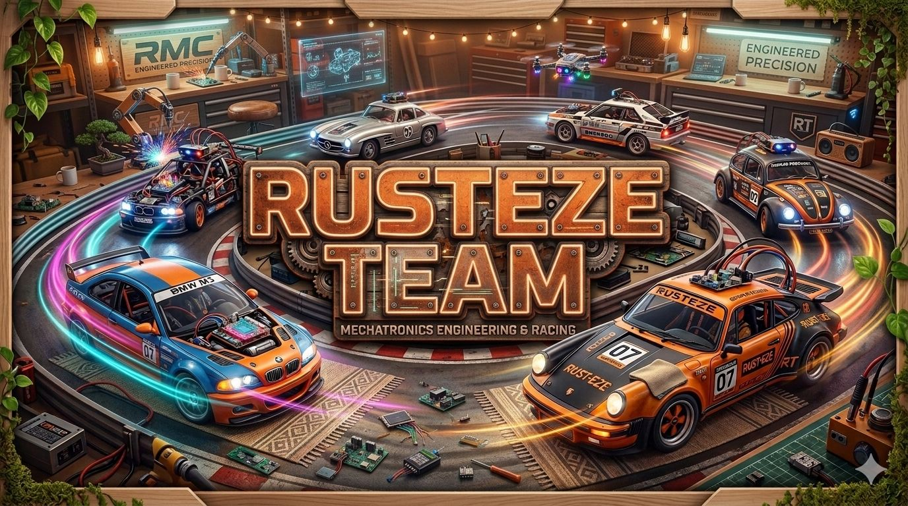

  

<h1 align="center">Contributing</h1>

  Project collaboration, contributors, and participation areas.

---

## Overview

This project is being developed collaboratively as part of a robotics and autonomous systems effort.  
The repository brings together contributions related to ROS 2 development, embedded systems integration, sensor experimentation, AI-based calibration, and technical documentation.

## About Us

### **Rusteze Team**

We are students from the Faculty of Informatics at the Autonomous University of Queretaro and members of CICCTE LabPercepcion. As a development team, we focus on embedded systems for automotive and robotics applications.

We are committed to delivering reliable and practical solutions while optimizing the use of available materials and budget. Our work is motivated by the intention to support research, promote learning, and create meaningful opportunities for innovation.

## Contributors

### **Moises Aguillon**

Software Engineering student focused on embedded systems, data acquisition, and systems integration.

- Project development and system integration
- ROS 2 workspace organization
- `motor_controller` package development
- Docker environment setup and repository structure
- Testing and Validation

### **Alejandro Estrada**

Developer focused on robotics interfaces and real-time systems integration, contributing to the mobile control platform for robotic operation.

- Developed the mobile control application using React Native.
- Implemented WebSocket-based communication for real-time robot control.
- Designed the control HUD interface including joystick navigation, telemetry, and system status monitoring.

### **César Núñez**

Software Engineering student focused on embedded systems, data acquisition, electronic, and systems integration.

- Schema designer of the electrical conections
- Made all the enviorment on docker
- Loaded the main libraries on the dockerfile
- Development and training of the AI model and sensor´s calibration
- Testing and Validation

## Contribution Areas

Contributors may participate in areas such as:

- ROS 2 node development
- Motor control logic
- Embedded systems integration
- Sensor calibration and data analysis
- AI model experimentation
- Testing and validation
- Documentation and repository maintenance

## Collaboration Notes

To keep the repository organized:

- Use clear branch names for new features, experiments, or tests
- Document meaningful changes before pushing
- Avoid committing generated files such as build artifacts, logs, and temporary files
- Keep source code, scripts, and documentation clean and readable
- Follow the repository structure whenever adding new modules or assets

## Acknowledgment

This repository reflects the collaborative effort of all contributors involved in the design, implementation, testing, and documentation of the project.