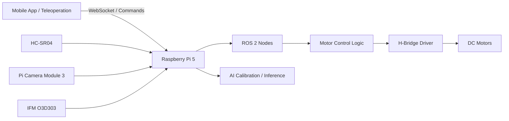

<p align="center">
  
</p>

<h1 align="center">ROS2-Based Autonomous Vehicle Prototype</h1>

<p align="center">
  Autonomous robotics and embedded experimentation with ROS 2, motor control, and AI-based sensor calibration.
</p>

<p align="center">
  <a href="#overview">Overview</a> •
  <a href="#repository-structure">Repository Structure</a> •
  <a href="#main-components">Main Components</a> •
  <a href="#getting-started">Getting Started</a> •
  <a href="#technologies">Technologies</a> •
  <a href="CONTRIBUTING.md">Contributing</a>
</p>

---

## 📘 Overview

This repository contains the development environment, ROS 2 workspace, and calibration-related components for an autonomous robotics project, developed as a contribution to the PhD project **"Acquisition System and Data Processing for Autonomous Vehicles"**.

This project proposes the acquisition of data through an embedded multisensory system and the processing of that data in a central electronic unit, such as an Electronic Control Unit (ECU) or Powertrain Control Module (PCM). By integrating the collected data and applying an artificial intelligence model for decision-making, the system aims to enable autonomous behavior in a 1:16 scale Porsche 911 GT3 RS vehicle prototype. This prototype serves as a preliminary validation platform before scaling the solution to a full-size 1:1 vehicle.

The project integrates:

- ROS 2 nodes for motor control and communication (autonomous and manual) for a 1:16 scale vehicle
- Docker-based environment setup
- AI-based calibration experiments for ultrasonic sensor data and autonomous driving
- Supporting scripts, datasets, testing utilities and configuration components

## 📂 Repository Structure

```text
.
├── Docker/
│   ├── Dockerfile
│   └── entrypoint.sh
├── assets/
│   ├── Diagram.jpeg
│   ├── wiring.png
│   ├── ros_graph.png
│   └── demo.gif
├── docs/
│   └── README.md
├── model_ai_calibration/
│   ├── proyecto_calibracion/
│   │   ├── calibracion_ultrasonico_40hz_test.csv
│   │   ├── data_set_calibracion.csv
│   │   ├── datos_prueba_ia.csv
│   │   ├── train_model.py
│   │   ├── test_model.py
│   │   └── test_ia_tiempo_real.py
│   └── rayo_mc/
│       ├── auto_ia.py
│       ├── modelo_calibracion.h5
│       ├── modelo_calibracion.keras
│       ├── modelo_calibracion_patched.h5
│       └── scaler.pkl
├── ros2_ws/
│   └── src/
│       └── motor_controller/
├── README.md
├── CONTRIBUTING.md
└── LICENSE

```

## 🧩 Main Components

### `ros2_ws`

ROS 2 workspace containing the main package implementations, including motor control nodes, publishers, subscribers, and related tests.

### `Docker`

Containerized development environment used to support dependency management and project portability.

### `model_ai_calibration`

Calibration and AI experimentation area. This section contains training scripts, evaluation scripts, and calibration datasets for ultrasonic sensor behavior analysis.

## 🛠️ Technologies

This project integrates software, embedded systems, electronics, and AI-based calibration technologies for the development of an autonomous 1:16 scale vehicle prototype.

### Software and Development
- Python 3.11.9
- Docker
- ROS 2 Humble
- Linux / SSH remote access

### Embedded and Hardware
- Raspberry Pi 5 as the main ECU
- Ethernet and GPIO-based communication for sensor and actuator interfacing
- DC motors
- H-bridge motor driver
- HC-SR04 ultrasonic sensor
- Pi cam module 3
- ToF sensor O3D303
- Power supply analysis for ECU, sensors, actuators, and onboard electronics
- Voltage divider circuit for safe ultrasonic sensor integration

### Robotics and Control
- ROS 2 nodes for motor control and communication
- Keyboard-based teleoperation (WASD over SSH)
- Migration from manual keyboard input to sensor-based autonomous input
- PWM-based motor speed control for acceleration and deceleration

### Data Processing and AI
- Sensor calibration through raw data acquisition
- CSV dataset generation for calibration and validation
- Statistical analysis of measurement accuracy and error
- Neural network models for sensor correction and prediction
- MLP and FFN architectures
- Adam optimizer and Leaky ReLU activation
- Export of trained models in `.keras` and `.h5` formats

### Planned Sensor Integration
- Raspberry Pi Camera Module 3
- IFM O3D303 Time-of-Flight sensor
- ROS 2-based integration of camera and ToF sensor streams into the autonomous system
- Camera calibration for perception and visual integration
- Multisensory data acquisition for future perception and decision-making stages

> Note: The Raspberry Pi Camera Module 3 is planned to be calibrated as part of the system integration process. The calibration of the IFM O3D303 is outside the scope of this repository. The main focus of this project is the ROS 2-based integration of both sensors into the multisensory embedded system.

### Validation and Testing
- Software and hardware connection validation
- Unit testing for the HC-SR04 sensor
- Calibration repeatability tests
- Distance correction validation against real measured values

## 🚀 Getting Started

### Prerequisites

Before starting, make sure you have:

- Docker installed and running
- A Raspberry Pi 5 for GPIO and camera access
- This repository cloned locally
- The required hardware connected properly

> Note: This project is intended to run on a Raspberry Pi 5 with hardware access enabled. Some features such as GPIO, camera streaming, and sensor interfacing will not work correctly on a standard desktop environment.

### Clone the repository

```bash
git clone https://github.com/CesarN27/ros2_autonomous_docker.git
cd ros2_autonomous_docker
```

### Build the Docker image

```bash
docker build -t ros2-autonomous-gpio -f Docker/Dockerfile .
```

### Run the Docker container
```bash
docker run -it --rm --privileged \
  --network host \
  -v $(pwd)/ros2_ws:/ros2_ws \
  -v $(pwd)/model_ai_calibration:/ros2_ws/src/sensor_ai \
  -v /dev:/dev \
  -v /run/udev:/run/udev:ro \
  ros2-autonomous-gpio
```

### Build the ROS 2 workspace

Inside the container:

```bash
cd /ros2_ws
rm -rf install build log
colcon build
source install/setup.bash
```

### Run a node

```bash
ros2 run motor_controller teleop_motor
```

## 🧠 ROS 2 Nodes and Interfaces

Main package: `motor_controller`

Example executable nodes:
- `teleop_motor`
- `rayows`
- `pruebarayo`


## 🏗️ System Architecture



## 🔌 Hardware Overview

- Raspberry Pi 5 as the main embedded processing unit
- HC-SR04 for short-range obstacle distance acquisition
- Pi Camera Module 3 for visual perception
- IFM O3D303 as planned ToF sensing module
- H-bridge motor driver for actuation
- DC motors for traction and steering
- Voltage divider for safe HC-SR04 echo interfacing with Raspberry Pi GPIO

## 📊 Results

Current validated results include:

- HC-SR04 raw distance acquisition tests
- Calibration dataset generation
- AI-based correction model training
- Initial real-time inference tests
- Teleoperation and motor actuation validation

Example metrics to report:
- Mean absolute error before calibration
- Mean absolute error after calibration
- Improvement percentage
- Sampling frequency
- Inference latency on Raspberry Pi 5

## 🗺️ Roadmap

- [x] Dockerized ROS 2 development environment
- [x] Basic motor control package
- [x] Keyboard-based teleoperation
- [x] Ultrasonic dataset generation
- [x] AI calibration model training
- [ ] Pi Camera Module 3 integration
- [ ] IFM O3D303 integration
- [ ] Sensor fusion stage
- [ ] Autonomous decision layer
- [ ] Full perception-validation workflow on vehicle prototype

## ⚠️ Current Limitations

- The project is hardware-dependent and requires Raspberry Pi GPIO access
- Camera and ToF integration are still under development
- Validation has been focused mainly on ultrasonic calibration and motor control
- Full multisensor fusion is not yet implemented