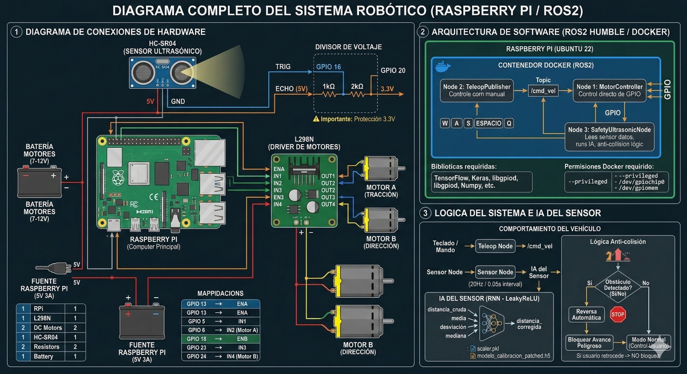

<p align="center">
  
</p>

<h1 align="center">ROS2 Autonomous Docker</h1>

<p align="center">
  Autonomous robotics and embedded experimentation with ROS 2, motor control, and AI-based sensor calibration.
</p>

<p align="center">
  <a href="#overview">Overview</a> •
  <a href="#repository-structure">Repository Structure</a> •
  <a href="#main-components">Main Components</a> •
  <a href="#getting-started">Getting Started</a> •
  <a href="CONTRIBUTING.md">Contributing</a>
</p>

---

## Overview

This repository contains the development environment, ROS 2 workspace, and calibration-related components for an autonomous robotics project in contribiution to a PhD "Adquisition system and data processing for autonomous vehicles".

The project integrates:

- ROS 2 nodes for motor control and communication (autonomous and manual) for a motor controller car scaled 1:16.
- Docker-based environment setup
- AI-based calibration experiments for ultrasonic sensor data and autonomous driving
- Supporting scripts, datasets, testing utilities and configuration components

## Repository Structure

```text
.
├── model_ai_calibration/
├── ros2_ws/
│   └── ros2_ws/
│       └── src/
│           └── motor_controller/
├── assets/
├── README.md
└── CONTRIBUTING.md

## Main Components

### `ros2_ws`

ROS 2 workspace containing the main package implementations, including motor control nodes, publishers, subscribers, and related tests.

### `motor_controller`

ROS 2 package for control logic and node execution. This includes motion-related scripts and communication nodes used in the autonomous system.

### `model_ai_calibration`

Calibration and AI experimentation area. This section contains training scripts, evaluation scripts, and calibration datasets for ultrasonic sensor behavior analysis.

## Getting Started

### Clone the repository

```bash
git clone <your-repository-url>
cd ros2_autonomous_docker

## Build the ROS 2 workspace

```bash
cd ros2_ws/ros2_ws
colcon build
source install/setup.bash

## Run a node

```bash
ros2 run motor_controller <node_name>