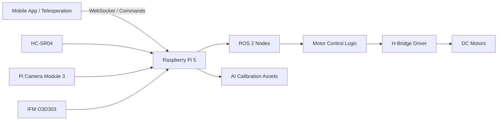

<p align="center">
  
</p>

<h1 align="center">ROS2-Based Autonomous Vehicle Prototype</h1>

<p align="center">
  Autonomous robotics and embedded experimentation with ROS 2, motor control, and AI-assisted ultrasonic calibration experiments.
</p>

<p align="center">
  <a href="#overview">Overview</a> •
  <a href="#current-capabilities">Current Capabilities</a> •
  <a href="#main-directories">Main Directories</a> •
  <a href="#getting-started">Getting Started</a> •
  <a href="#documentation">Documentation</a> •
  <a href="CONTRIBUTING.md">Contributing</a>
</p>

---

## 📘 Overview

This repository contains the ROS 2 workspace, Docker environment, embedded control logic, and calibration-related assets for a **1:14 scale autonomous vehicle prototype** developed on **Raspberry Pi 5**.

The project is part of a broader research-oriented effort focused on **multisensory embedded systems for autonomous vehicles**, using a scaled platform as an initial validation environment before future migration to larger systems.

At its current stage, the repository supports motor control, keyboard and mobile teleoperation, ultrasonic-based safety logic, MJPEG video streaming, and AI-assisted calibration experiments for distance sensing.

## 📌 Current Capabilities

- ROS 2-based motor control for a 1:14 scale vehicle
- Keyboard teleoperation through terminal / SSH
- Mobile teleoperation through WebSocket commands
- Live MJPEG camera streaming
- Ultrasonic obstacle monitoring and emergency-stop behavior
- AI-assisted ultrasonic calibration workflow
- Dockerized development and execution environment on Raspberry Pi 5

## 📂 Main Directories

- `ros2_ws/`: ROS 2 workspace containing the `motor_controller` package and runtime nodes
- `model_ai_calibration/`: datasets, training scripts, exported models, and calibration experiments
- `Docker/`: containerized environment for reproducible setup and deployment
- `docs/`: extended technical documentation, setup notes, and project references


## 🧩 Main Runtime Flows

- **`teleop_motor`**: basic keyboard teleoperation for motor validation
- **`pruebarayo`**: integrated keyboard control, ultrasonic safety, and AI-corrected validation flow
- **`rayows`**: modular runtime for WebSocket teleoperation, MJPEG streaming, and integrated robot-side services

## 🛠️ Technologies

This project integrates software, embedded systems, electronics, and AI-based calibration technologies for the development of an autonomous 1:14 scale vehicle prototype.

### Software

- Python 3.11.9
- Docker
- ROS 2 Humble
- Linux / SSH remote access

### Embedded and Hardware

- Raspberry Pi 5
- HC-SR04 ultrasonic sensor
- Pi Camera Module 3
- IFM O3D303 ToF sensor (planned integration)
- H-bridge motor driver
- DC motors
- GPIO-based actuator and sensor interfacing

### Robotics and Control

- ROS 2 nodes for motor control and communication
- Keyboard-based teleoperation (WASD over SSH)
- Mobile app-based teleoperation through a joystick interface over WebSocket
- Migration from manual input to sensor-based autonomous input
- PWM-based motor speed control for acceleration, deceleration, and vehicle steering control

### AI and Calibration

- CSV-based dataset generation
- Neural-network-based sensor correction
- Exported .keras and .h5 models
- Runtime calibration asset integration for validation flows

## 🚀 Getting Started

### Prerequisites

Before starting, make sure you have:

- Docker installed and running
- A Raspberry Pi 5 for GPIO and camera access
- This repository cloned locally
- The required hardware connected properly

> Note: This project is intended to run on a Raspberry Pi 5 with hardware access enabled. Some features such as GPIO, camera streaming, and sensor interfacing will not work correctly on a standard desktop environment.

### Clone the repository

```bash
git clone https://github.com/CesarN27/ros2_autonomous_docker.git
cd ros2_autonomous_docker
```

### Build the Docker image

```bash
docker build -t ros2-autonomous-gpio -f Docker/Dockerfile .
```

### Run the Docker container
```bash
docker run -it --rm --privileged \
  --network host \
  -v $(pwd)/ros2_ws:/ros2_ws \
  -v $(pwd)/model_ai_calibration:/ros2_ws/src/sensor_ai \
  -v /dev:/dev \
  -v /run/udev:/run/udev:ro \
  ros2-autonomous-gpio
```

### Build the ROS 2 workspace

Inside the container:

```bash
cd /ros2_ws
rm -rf install build log
colcon build
source install/setup.bash
```

## 🧠 Available ROS 2 Executables

Main package: `motor_controller`

### Run a node

```bash
ros2 run motor_controller teleop_motor
```

Other available executables:

```bash
ros2 run motor_controller pruebarayo
ros2 run motor_controller rayows
```

## 📱 Mobile App Integration

This repository contains the ROS 2 runtime, embedded control logic, WebSocket bridge, and MJPEG streaming backend for the vehicle.

The mobile control application is maintained in a separate repository:

- **Mobile App Repository:** [RayoMacApp](https://github.com/Eto204/RayoMacApp)

The external mobile app communicates with this repository through:
- **WebSocket control:** `ws://<robot-ip>:8765/`
- **MJPEG video stream:** `http://<robot-ip>:8080/stream`

> Note: The mobile application is not included in this repository. This repository only provides the robot-side services consumed by the app.


## 🏗️ System Architecture



## 📚 Documentation

For detailed technical information, see:

- [Technical Documentation](docs/README.md)
- [Bash setup guide](docs/bash_setup.md)
- [Contributing guide](CONTRIBUTING.md)

The technical documentation includes:

- Hardware setup and wiring
- ROS 2 node descriptions
- Calibration pipeline details
- Validation scope
- Known limitations
- Bill of materials

## 📊 Current Status

Validated so far:

- Motor actuation and teleoperation
- HC-SR04 distance acquisition
- Emergency-stop logic
- MJPEG streaming backend
- Calibration dataset generation
- AI model training and export

Under active development:

- Camera integration refinement
- IFM O3D303 integration
- Multisensor fusion
- Autonomous decision layer

## 🗺️ Roadmap

- [x] Dockerized ROS 2 development environment
- [x] Basic motor control package
- [x] Keyboard-based teleoperation
- [x] Ultrasonic dataset generation
- [x] AI calibration model training
- [ ] Pi Camera Module 3 integration
- [ ] IFM O3D303 integration
- [ ] Sensor fusion stage
- [ ] Autonomous decision layer
- [ ] Full perception-validation workflow on vehicle prototype

## ⚠️ Current Limitations

- The project is hardware-dependent and requires Raspberry Pi GPIO access
- Full multisensor fusion is not yet implemented
- The mobile application is maintained in a separate repository
- Some AI-assisted runtime features depend on external model assets being present