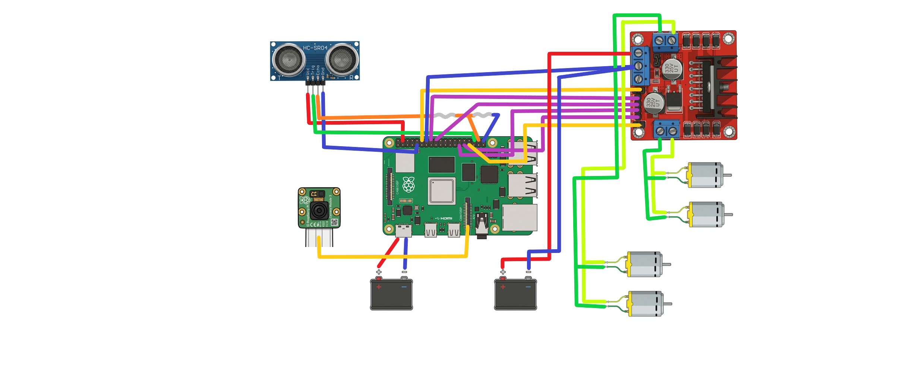

# Technical Documentation

This document describes the technical structure, deployment rationale, hardware configuration, ROS 2 nodes, and validation scope of the **ROS2-Based Autonomous Vehicle Prototype** repository.

This project focuses on the development of a **1:14 scale autonomous vehicle prototype** based on **ROS 2**, **Docker**, **Raspberry Pi 5**, and an initial **AI-assisted calibration workflow** for ultrasonic sensing. The repository serves as a development and validation platform for a multisensory embedded system within a broader research-oriented effort on **multisensory embedded systems for autonomous vehicles**, using a scaled platform as an initial validation environment before future migration to larger systems.

> For the project overview, quick start instructions, and repository entry point, see the main [README](../README.md).

---

## Contents
- [1. Environment Setup](#1-environment-setup)
- [2. Hardware Setup](#2-hardware-setup)
- [3. Wiring](#3-wiring)
- [4. ROS Nodes](#4-ros-nodes)
- [5. Calibration Pipeline](#5-calibration-pipeline)
- [6. Validation](#6-validation)
- [7. Known Limitations](#7-known-limitations)
- [8. Bill of Materials](#8-bill-of-materials)

---

## 📂 Repository Structure

```text
.
├── Docker/
│   ├── Dockerfile
│   └── entrypoint.sh
├── assets/
│   ├── Diagram.jpeg
│   ├── wiring.png
│   ├── ros_graph.png
│   └── demo.gif
├── docs/
│   ├── README.md
│   └── bash_setup.md
├── model_ai_calibration/
│   ├── proyecto_calibracion/
│   │   ├── calibracion_ultrasonico_40hz_test.csv
│   │   ├── data_set_calibracion.csv
│   │   ├── datos_prueba_ia.csv
│   │   ├── train_model.py
│   │   ├── test_model.py
│   │   └── test_ia_tiempo_real.py
│   └── rayo_mc/
│       ├── auto_ia.py
│       ├── modelo_calibracion.h5
│       ├── modelo_calibracion.keras
│       ├── modelo_calibracion_patched.h5
│       └── scaler.pkl
├── ros2_ws/
│   └── src/
│       └── motor_controller/
│           ├── package.xml
│           ├── setup.py
│           └── motor_controller/
│               ├── __init__.py
│               ├── camera_stream.py
│               ├── config.py
│               ├── fuzzy.py
│               ├── mjpeg_server.py
│               ├── motor_controller_node.py
│               ├── pruebarayo.py
│               ├── rayows.py
│               ├── safety_ultrasonic_node.py
│               ├── teleop_motor_node.py
│               ├── video_state.py
│               └── websocket_bridge.py
├── README.md
├── CONTRIBUTING.md
└── LICENSE
```

## 1. Environment Setup

### 1.1 Purpose of the environment

This project uses a Docker-based environment to provide a reproducible development and execution space for **ROS 2 Humble** and the required Python dependencies on **Raspberry Pi 5**, without replacing the host operating system.

This decision was made to simplify:
- dependency installation,
- workspace portability,
- environment reproducibility,
- hardware-oriented testing on the target embedded platform.

### 1.2 Host requirements

Before running the project, make sure the following are available:

- Raspberry Pi 5
- Docker installed and running
- Local clone of this repository
- Hardware properly connected and powered
- Access to `/dev` and GPIO interfaces enabled through Docker runtime flags
- Camera interface enabled, if MJPEG streaming will be used
- Local network connectivity, if teleoperation from the external mobile app will be used

Reference development environment:
- Raspberry Pi OS (Debian GNU/Linux 13.3 "trixie")
- Kernel version: `6.12.62+rpt-rpi2712`

> **Note:** This repository is intended to run on a Raspberry Pi 5 with hardware access enabled. Features such as GPIO control, camera streaming, and sensor interfacing are hardware-dependent and may not work correctly on a standard desktop environment.

### 1.3 Clone the repository

```bash
git clone https://github.com/CesarN27/ros2_autonomous_docker.git
cd ros2_autonomous_docker
```

### 1.4 Build the Docker image

```bash
docker build -t ros2-autonomous-gpio -f Docker/Dockerfile .
```

### 1.5 Run the container

```bash
docker run -it --rm --privileged \
  --network host \
  -v $(pwd)/ros2_ws:/ros2_ws \
  -v $(pwd)/model_ai_calibration:/ros2_ws/src/sensor_ai \
  -v /dev:/dev \
  -v /run/udev:/run/udev:ro \
  ros2-autonomous-gpio
```

### 1.6 Build the ROS 2 workspace

```bash
cd /ros2_ws
rm -rf install build log
colcon build
source install/setup.bash
```

### 1.7 Run executable nodes

Example:

```bash
ros2 run motor_controller teleop_motor
```

Other executables available in the package:

```bash
ros2 run motor_controller pruebarayo
ros2 run motor_controller rayows
```

### 1.8 Deployment rationale

Although ROS 2 is commonly debugged using multiple terminal sessions during development, this prototype was progressively consolidated into integrated runtime scripts to simplify deployment and reduce orchestration complexity on the embedded platform.

This was especially useful because the same system needs to coordinate:

- ROS 2 communication,
- GPIO motor actuation,
- ultrasonic safety logic,
- WebSocket-based remote commands,
- MJPEG video streaming,
- and future camera / perception extensions.

## 2. Hardware Setup

### 2.1 Embedded platform

The prototype is built around a Raspberry Pi 5, used as the main embedded processing unit (ECU). In the context of this repository, the Raspberry Pi acts as the central node for:

- ROS 2 execution,
- motor control,
- GPIO interaction,
- sensor data acquisition,
- camera streaming,
- and integration with AI-based calibration components.

### 2.2 Main hardware components

The current repository and README describe the following hardware stack:

- Raspberry Pi 5 as the main ECU / embedded controller
- HC-SR04 ultrasonic sensor for frontal obstacle distance acquisition
- Pi Camera Module 3 for visual data acquisition and MJPEG streaming
- IFM O3D303 ToF sensor as a planned integration target
- H-bridge motor driver for traction and steering actuation
- DC motors for motion
- Voltage divider for safe ultrasonic echo integration to Raspberry Pi GPIO

### 2.3 Functional Architecture

At the system level, the prototype is organized around the following flow:

1. Teleoperation commands, either from an external mobile application over WebSocket or from a keyboard connected directly to the ECU, generate motion references.
2. ROS 2 nodes translate those references into low-level traction and steering actions.
3. The ultrasonic subsystem continuously monitors the frontal distance.
4. When calibration assets are available, the safety subsystem applies AI-assisted correction to ultrasonic distance estimation.
5. A fuzzy safety layer computes a speed-reduction factor based on the measured frontal distance and publishes it to modulate motor power during forward motion.
6. If a critical frontal stop condition is detected while the vehicle is moving forward, emergency braking is activated through `/emergency_stop`.
7. The motor controller reacts to `/cmd_vel`, `/fuzzy_cmd`, and `/emergency_stop`.
8. The video subsystem provides a live MJPEG stream for remote monitoring.
9. The AI calibration area supports data-driven improvement of ultrasonic distance estimation.

### 2.4 Operating Modes and Runtime Flows

The repository currently reflects at least these operating modes and runtime flows:

- Manual keyboard teleoperation through ROS 2
- Mobile / WebSocket teleoperation in the `rayows` flow
- Safety-assisted operation with fuzzy speed regulation based on frontal obstacle distance
- Emergency-stop protection for critical frontal obstacles during forward motion
- Calibration-oriented sensing experiments using CSV datasets and trained models

## 3. Wiring

### 3.1 General Note

This section defines the canonical GPIO mapping for the project.

The following tables describe the reference hardware wiring used for the Raspberry Pi 5, the HC-SR04 ultrasonic sensor, and the L298N motor driver. This documented configuration should be treated as the official connection model for integration, validation, and future maintenance of the system.

| Raspberry Pi Pin |   GPIO   | Specification |  Module  | Function |
| ---------------- | -------: | ------------- | -------- | -------- |
|       4          | 5V power |      Vcc      |  HC-SR04 |    Vcc   |
|       9          |  Ground  |     Ground    |  HC-SR04 |    Gnd   |
|       36         |  GPIO 16 |    GPIO 16    |  HC-SR04 |    Trig  |
|       38         |  GPIO 20 |    PCM_DIN    |  HC-SR04 |    Echo  |
|       40         |  GPIO 21 |    PCM_DOUT   |  HC-SR04 |  Divider |
|       12         |  GPIO 18 |    PCM_CLK    |   L298N  |    ENA   |
|       14         |  Ground  |     Ground    |   L298N  |    Gnd   |
|       16         |  GPIO 23 |    GPIO 23    |   L298N  |    IN1   |
|       18         |  GPIO 24 |    GPIO 24    |   L298N  |    IN2   |
|       29         |  GPIO 5  |    GPIO 5     |   L298N  |    IN3   |
|       31         |  GPIO 6  |    GPIO 6     |   L298N  |    IN4   |
|       33         |  GPIO 13 |     PWM1      |   L298N  |    ENB   |

**L298N connections to the vehicle base**:

| Function | Notes                            |
| -------- | -------------------------------: |
| OUTPUT A | Front motors of the vehicle base |
| OUTPUT B | Rear motors of the vehicle base  |
| Vcc      | Vehicle base power supply        |
| Gnd      | Vehicle base ground              |


### 3.2 Voltage Divider Note

Because the HC-SR04 `ECHO` output operates at 5 V and Raspberry Pi GPIO inputs are limited to 3.3 V logic, a resistive voltage divider is required before connecting the sensor output to the Raspberry Pi input pin.

In the project wiring, the `ECHO` signal is routed through two resistors arranged as a voltage divider:

- The `ECHO` output from the HC-SR04 first passes through resistor **R1**
- The junction between **R1** and **R2** is connected to **GPIO 20**, which is used as the input signal pin
- From that same junction, the circuit passes through resistor **R2** to **GND**

This arrangement reduces the 5 V `ECHO` signal to a safe logic level for the Raspberry Pi.

#### Voltage Divider Calculation

The output voltage at the Raspberry Pi input is calculated as:

`Vout = Vin * (R2 / (R1 + R2))`

Where:

- `Vin` is the HC-SR04 `ECHO` output voltage
- `R1` is the resistor placed between `ECHO` and the GPIO input junction
- `R2` is the resistor placed between the GPIO input junction and GND
- `Vout` is the reduced voltage received by the Raspberry Pi GPIO pin

For safe operation, `Vout` must remain at or below **3.3 V**.

For example, using:

- `Vin = 5.0 V`
- `R1 = 1 kΩ`
- `R2 = 2 kΩ`

The resulting output voltage is:

`Vout = 5.0 * (2 / (1 + 2)) = 5.0 * (2 / 3) = 3.33 V`

The following diagram illustrates the reference hardware wiring used for Raspberry Pi GPIO integration, ultrasonic sensing, and motor control.

<p align="center">
  
</p>

Suggested asset reference: **`../assets/wiring.png`**

## 4. ROS Nodes

### 4.1 Main package

The main ROS 2 package in this repository is:

```bash
motor_controller
```

The package metadata and setup configuration expose the following executable nodes:

- teleop_motor
- pruebarayo
- rayows

### 4.2 Topic-level design

The control architecture is built around the following core topics:

| Topic             | Type                      | Purpose                    |
| ----------------- | ------------------------- | -------------------------- |
| `/cmd_vel`        | `geometry_msgs/msg/Twist` | Motion command input       |
| `/emergency_stop` | `std_msgs/msg/Bool`       | Safety brake / stop signal |


### 4.3 `teleop_motor`

**Purpose**

Basic ROS 2 teleoperation flow using keyboard input over terminal / SSH.

**Internal roles**

This executable combines:

- a publisher node that reads keyboard input,
- and a motor controller node that subscribes to /cmd_vel.

**Behavior**

- W / S controls forward and reverse motion
- A / D controls steering
- combined actions such as WA, WD, SA, SD are supported conceptually through the velocity command logic
- Q exits the program

**Main interfaces**

| Node role         | Publishes  | Subscribes |
| ----------------- | ---------- | ---------- |
| `TeleopPublisher` | `/cmd_vel` | —          |
| `MotorController` | —          | `/cmd_vel` |


**Recommended usage**

Use this executable for:

 - initial motor validation,
 - GPIO behavior checks,
 - simple manual motion tests,
 - SSH-based bench testing.

### 4.4 `pruebarayo`

**Purpose**

Integrated ROS 2 executable used for end-to-end functional validation of the vehicle, combining:

- keyboard-based motion control through WASD input,
- motor command execution,
- ultrasonic safety monitoring,
- and AI-based correction of ultrasonic distance estimation at runtime.

This executable is intended to validate the complete manual-control and sensing pipeline in a single integrated runtime flow.

**Internal roles**

This executable includes at least:

- `MotorController`
- `TeleopPublisher`
- `SafetyUltrasonicNode`

**Behavior**

- reads keyboard input and publishes motion commands to `/cmd_vel`
- allows manual validation of forward, reverse, and steering behavior
- monitors `/cmd_vel` to determine whether forward motion is active
- reads ultrasonic distance measurements from the HC-SR04 sensor
- applies AI-based correction using the loaded model and scaler assets
- publishes `/emergency_stop` when the corrected obstacle distance falls below the configured danger threshold while forward motion is active
- stops motor actuation when an emergency stop condition is triggered

**Keyboard controls**

- `W`: forward
- `S`: reverse
- `A`: steer left
- `D`: steer right
- `C`: center steering
- `Space`: full stop
- `Q`: exit

**Current safety threshold**

```bash
DISTANCIA_PELIGRO = 15.0 cm
```

**Main Interfaces**

| Node role              | Publishes         | Subscribes                    |
| ---------------------- | ----------------- | ----------------------------- |
| `TeleopPublisher`      | `/cmd_vel`        | `/emergency_stop`             |
| `MotorController`      | —                 | `/cmd_vel`, `/emergency_stop` |
| `SafetyUltrasonicNode` | `/emergency_stop` | `/cmd_vel`                    |

**AI Integration**

This executable loads:

- `modelo_calibracion.h5`
- `scaler.pkl`

These assets are used to improve raw ultrasonic distance estimation before making safety decisions.

**Recommended usage**

Use this executable for:

- keyboard-based motion validation through WASD control,
- integrated validation of sensing, control, and emergency-stop behavior,
- ultrasonic calibration experiments during runtime,
- emergency braking tests under forward motion,
- combined manual control + AI-corrected sensing runs.

### 4.5 `rayows`

**Purpose**

Main integrated runtime of the project, intended as the canonical execution flow for the vehicle system.

In its current modular implementation, this runtime integrates:

- ROS 2-based motor control
- ultrasonic safety monitoring
- AI-assisted ultrasonic distance correction when calibration assets are available
- fuzzy speed regulation based on frontal obstacle distance
- WebSocket command input for external teleoperation
- MJPEG live video streaming for remote observation

This executable is currently under active development and is intended to become the main integration entry point for future sensors, calibration models, and mobile-app-based teleoperation features.

**Current modular structure**

The visible implementation is currently split into the following modules:

- `rayows.py`: main entry point and runtime orchestration
- `motor_controller_node.py`: low-level motor control and software PWM execution
- `safety_ultrasonic_node.py`: frontal distance monitoring, AI-assisted correction, fuzzy braking logic, and emergency-stop signaling
- `websocket_bridge.py`: remote command intake over WebSocket
- `camera_stream.py`: continuous camera capture and JPEG frame generation
- `mjpeg_server.py`: HTTP MJPEG streaming service
- `video_state.py`: shared frame buffer for the video subsystem
- `config.py`: centralized runtime configuration
- `fuzzy.py`: fuzzy braking factor logic

**Current behavior**

- receives remote joystick commands through WebSocket
- converts those commands into ROS 2 motion references on `/cmd_vel`
- interprets joystick axes as:
  - `y -> linear.x` for traction / speed
  - `x -> angular.z` for steering
- applies software PWM for both traction and steering control
- continuously reads frontal distance from the ultrasonic subsystem
- applies AI-based distance correction when the configured model and scaler are available
- computes a fuzzy braking factor based on frontal distance
- publishes the fuzzy speed factor on `/fuzzy_cmd`
- activates `/emergency_stop` only when forward motion is active and the braking factor reaches a full-stop condition
- provides a live MJPEG stream for remote observation

**Current ROS interfaces**

| Component                | Publishes                  | Subscribes                                 |
| ------------------------ | -------------------------- | ------------------------------------------ |
| `MotorController`        | `/cmd_vel`*, `/emergency_stop`* | `/cmd_vel`, `/emergency_stop`, `/fuzzy_cmd` |
| `SafetyUltrasonicNode`   | `/fuzzy_cmd`, `/emergency_stop` | `/cmd_vel`                                 |
| `WebSocketBridge`        | `/cmd_vel`, `/emergency_stop` (through the runtime bridge) | — |

> \* In the current implementation, these publishers are exposed through the motor runtime instance and are used by the WebSocket bridge.

**Current WebSocket configuration**

| Setting                |     Value |
| ---------------------- | --------: |
| Host                   | `0.0.0.0` |
| Port                   |    `8765` |
| Move rate              |   `20 Hz` |
| Expected joystick span | `-10..10` |

**WebSocket command model**

The current implementation accepts commands such as:

- `{"command": "MOVE", "x": ..., "y": ...}`
- `{"command": "EMERGENCY_STOP"}`
- `{"command": "RESUME"}`
- `{"command": "STOP"}`

For `MOVE` commands, joystick values are internally mapped as:

- `x` → steering
- `y` → traction / speed

These values are normalized internally using the configured joystick limit.

**Current video configuration**

| Setting         |       Value |
| --------------- | ----------: |
| Stream endpoint |   `/stream` |
| HTTP host       | `0.0.0.0`   |
| HTTP port       |      `8080` |
| FPS             |        `15` |
| Resolution      | `640 x 480` |
| JPEG quality    |        `70` |

**Main external interfaces**

| Interface role      | Endpoint / Topic                  |
| ------------------- | --------------------------------- |
| Motion commands     | `/cmd_vel`                        |
| Safety stop         | `/emergency_stop`                 |
| Fuzzy speed control | `/fuzzy_cmd`                      |
| WebSocket server    | `ws://<robot-ip>:8765/`           |
| MJPEG stream        | `http://<robot-ip>:8080/stream`   |

**Recommended usage**

Use this executable for:

- mobile-app-based teleoperation through WebSocket
- integrated motor, safety, and video runtime validation
- testing of fuzzy speed regulation and emergency-stop behavior
- validation of the current modular runtime architecture
- future expansion toward full multi-sensor integration in the main system flow

## 5. Calibration Pipeline

### 5.1 Objective

The calibration workflow is intended to improve ultrasonic measurement quality by collecting raw sensor data, generating datasets, training a model, and using the resulting model for corrected inference during runtime.

### 5.2 Repository calibration area

The repository organizes calibration-related work under:

```bash
model_ai_calibration/
├── proyecto_calibracion/
└── rayo_mc/
```

### 5.3 Dataset and experimentation flow

Based on the repository structure described in the main README, the calibration area includes:

- raw / processed CSV datasets,
- model training scripts,
- model testing scripts,
- real-time inference tests,
- exported trained models,
- and a scaler object for feature normalization.

### 5.4 Intended workflow

A practical interpretation of the current pipeline is:

1. Acquire raw ultrasonic sensor measurements.
2. Store data into CSV files for later analysis.
3. Build calibration datasets using controlled distance references.
4. Train a neural-network-based model for corrected distance estimation.
5. Export the trained model in .keras and .h5 formats.
6. Export the scaler used in preprocessing.
7. Load the model and scaler inside runtime safety nodes.
8. Use corrected distance estimates to improve emergency stop behavior.

### 5.5 Runtime AI usage in current scripts

The repository currently reflects two slightly different stages of AI integration:

- In pruebarayo.py, the ultrasonic safety flow actively uses model-based corrected distance for decision-making.
- In rayows.py, model and scaler paths are still declared for compatibility and future evolution, but the visible implementation notes that AI is not currently used inside the safety loop.

This distinction is important and should be documented clearly to avoid overstating the maturity of the AI runtime integration.

### 5.6 Data documentation

When you have time, add the following information here:

dataset acquisition conditions,
measurement range in centimeters,
number of samples,
sensor frequency target,
ambient conditions,
train/validation/test split,
features used by the model,
chosen loss function and optimizer,
inference latency on Raspberry Pi 5.

## 6. Validation

### 6.1 Current validation scope

The repository already reflects these validation areas:

- software and hardware connection validation,
- HC-SR04 raw distance acquisition tests,
- dataset generation,
- AI-based correction model training,
- initial real-time inference tests,
- teleoperation and motor actuation validation,
- calibration repeatability tests,
- distance correction validation against real measured values.

### 6.2 Validation philosophy

This project should be documented as an engineering prototype, not as a finished autonomous platform. For that reason, validation should be presented in progressive layers:

- electrical and GPIO validation,
- motor actuation validation,
- teleoperation validation,
- sensor acquisition validation,
- safety logic validation,
- AI-assisted correction validation,
- integrated runtime testing.

### 6.3 Validation table

Use the following table once your measurements are ready:

| Metric                       | Raw sensor | Calibrated / corrected | Notes                             |
| ---------------------------- | ---------: | ---------------------: | --------------------------------- |
| Mean Absolute Error (cm)     |     [TODO] |                 [TODO] | Compare against real distance     |
| Maximum Absolute Error (cm)  |     [TODO] |                 [TODO] | Worst-case error                  |
| Standard Deviation (cm)      |     [TODO] |                 [TODO] | Stability measure                 |
| Sampling Frequency (Hz)      |     [TODO] |                 [TODO] | Measured on Raspberry Pi 5        |
| Inference Latency (ms)       |          — |                 [TODO] | Runtime model latency             |
| Emergency Stop Distance (cm) |     [TODO] |                 [TODO] | Should align with threshold logic |


### 6.4 Functional test table

| Test                                           | Status | Notes |
| ---------------------------------------------- | ------ | ----- |
| Docker image builds successfully               | [TODO] |       |
| ROS 2 workspace builds successfully            | [TODO] |       |
| `teleop_motor` publishes `/cmd_vel`            | [TODO] |       |
| Motor controller reacts to `/cmd_vel`          | [TODO] |       |
| Ultrasonic distance can be read on hardware    | [TODO] |       |
| `/emergency_stop` is published below threshold | [TODO] |       |
| Vehicle brakes only during forward motion      | [TODO] |       |
| WebSocket control works in `rayows`            | [TODO] |       |
| MJPEG stream available on port 8080            | [TODO] |       |
| AI-corrected inference works in `pruebarayo`   | [TODO] |       |

### 6.5 Recommended evidence to attach

For stronger portfolio value, include:

one photo of the assembled prototype,

one screenshot of terminal output during ROS execution,

one screenshot of the MJPEG stream,

one graph of raw vs corrected distance,

one short GIF or video of motion + safety stopping behavior.

## 7. Known Limitations

### 7.1 Hardware dependence

This repository depends on access to:

- Raspberry Pi GPIO,
- connected actuators,
- sensor hardware,
- and camera interfaces.

As a result, full functionality is not reproducible on a generic desktop-only environment. The main runtime flows are intended to be executed on a Raspberry Pi-based setup with the required hardware connected and properly powered.

### 7.2 Partial multisensor integration

The project vision includes a multisensory platform, but current validation is still concentrated mainly on:

- motor control,
- teleoperation,
- ultrasonic sensing,
- ultrasonic safety logic,
- and ultrasonic calibration.

Camera streaming is already available as part of the current runtime, but broader multisensor integration and additional sensing modalities are still under development.

### 7.3 Incomplete sensor fusion stage

The system architecture anticipates a future fusion stage, but full multisensor fusion is not yet implemented.

At the current stage, sensing and safety decisions are still driven mainly by the ultrasonic subsystem, while future sensor fusion logic remains part of the planned system evolution.

### 7.4 Runtime architecture still evolving

The repository contains multiple executable flows corresponding to different development and validation stages, including:

- keyboard teleoperation,
- AI-assisted ultrasonic safety validation,
- and modular WebSocket + MJPEG operation through `rayows`.

This is useful during development, but it also means that some configuration details, execution scope, and integration boundaries are still being consolidated into a final reference runtime.

### 7.5 External mobile app integration is repository-separated

Mobile teleoperation is part of the overall system architecture, but the mobile application is maintained outside this repository.

As a result:

- This repository documents and exposes the robot-side WebSocket and MJPEG interfaces
- It does not contain the mobile UI implementation itself
- Complete app-to-robot validation depends on coordination between both repositories

### 7.6 AI-assisted calibration depends on external model assets

Some runtime and validation flows depend on trained calibration assets such as model and scaler files.

If those assets are missing, incompatible, or not deployed in the expected paths, the corresponding AI-assisted correction features may be unavailable or may fall back to raw sensor measurements.

### 7.7 Real-time control constraints

Motor actuation currently relies on software-managed PWM and runtime-level coordination between ROS 2 nodes, safety logic, WebSocket input, and video streaming.

Although this is adequate for the current prototype stage, timing behavior may still vary depending on host load, thread scheduling, and hardware conditions. This should be considered a prototype-level implementation rather than a final hard real-time control architecture.

### 7.8 Documentation and metrics still in progress

Some sections of the project are already structurally defined in the README, but still require final engineering evidence and consolidation, including:

- quantitative error metrics,
- stable final wiring documentation,
- consolidated benchmark results,
- final execution notes for each runtime flow,
- and clearer validation boundaries between current functionality and future planned integration.


## 8. Bill of Materials

> Note: Costs should be updated according to your actual purchases or local supplier quotes.

| Item                              |  Quantity      | Purpose                                        | Approx. Cost (MXN)| Notes                       |
| --------------------------------  | -------------: | ---------------------------------------------- | ----------------: | --------------------------- |
| Raspberry Pi 5 (with accessories) |              1 | Main embedded controller                       |     $5,989.00     | Main execution platform     |
| MicroSD / storage                 |              1 | OS and project storage                         |       $423.00     | Stores Raspberry Pi OS, ROS 2 workspace, configuration, and logs |
| Power supply for Raspberry Pi 5   |              1 | Stable power input                             |       $199.00     | Dedicated supply for stable operation during development and testing |
| HC-SR04 ultrasonic sensor         |              1 | Distance acquisition                           |        $57.00     | Used for frontal obstacle detection and safety logic |
| Pi Camera Module 3                |              1 | Vision streaming / future perception           |       $917.00     | Used for MJPEG streaming and future perception-oriented integration |
| IFM O3D303 ToF sensor             |              1 | Planned depth sensing                          |    $31,428.00     | Optional component planned for future multisensor perception stages |
| H-bridge motor driver             |              1 | Motor actuation interface                      |        $98.00     | Interfaces Raspberry Pi control signals with the vehicle motors |
| Voltage divider resistors         |              2 | Safe Echo level adaptation                     |         $2.00     | One resistive divider for HC-SR04 ECHO to Raspberry Pi GPIO; exact values pending hardware confirmation |
| Wiring / jumpers / connectors     |     assorted   | Electrical integration                         | $75.00 - $150.00  | Approximate cost for a basic jumper |
| Chassis / 1:14 vehicle platform   |              1 | Physical prototype base                        |     $1,249.00     | Porsche 911 GT3 RS platform |
| Chassis battery pack              | 5 AA batteries | Vehicle-side power supply for the chassis base |       $239.00     | Battery pack integrated into the vehicle base |


### 8.1 Estimated Total Cost

| Configuration | Estimated Total (MXN) |
| ------------- | --------------------: |
| Current prototype (without optional ToF sensor) | $9,248.00 - $9,323.00 |
| Extended configuration (including IFM O3D303 ToF sensor) | $40,676.00 - $40,751.00 |

> **Note:** The total is presented as a range because the cost of wiring / jumpers / connectors may vary depending on the selected kit or supplier. The IFM O3D303 ToF sensor is considered an optional future-stage component.